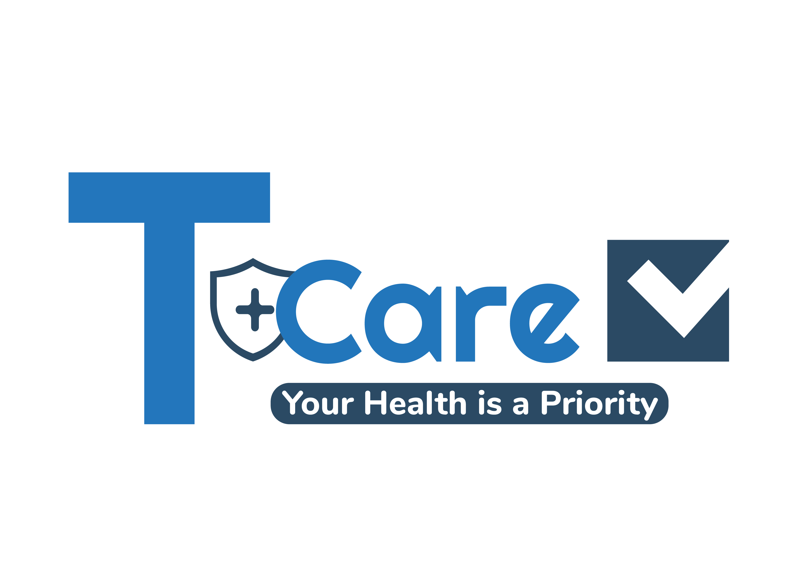

## About Project 

This project about the E-health, it consists on developing a web application that allows doctors to manage their patient’s files and their appointments. It contains principally two types of accounts : the admins’ account that manages the users and the doctor’s account. During a visit, the doctor can modify the patient’s medical file by adding the various information related to the patient and the prescription given. His secretary can also, via the same account, manage his appointment calendar. The application also provides a service to anyone that wants to go to a doctor by allowing him to do the research, discover the allowed profiles and take the details of the most suitable doctor.

